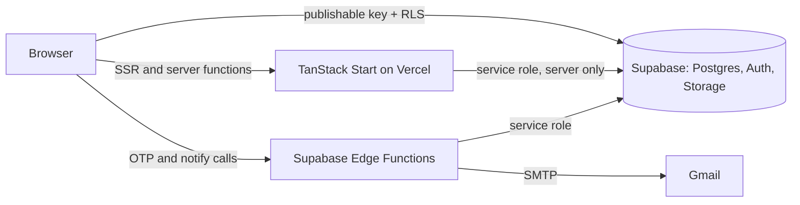
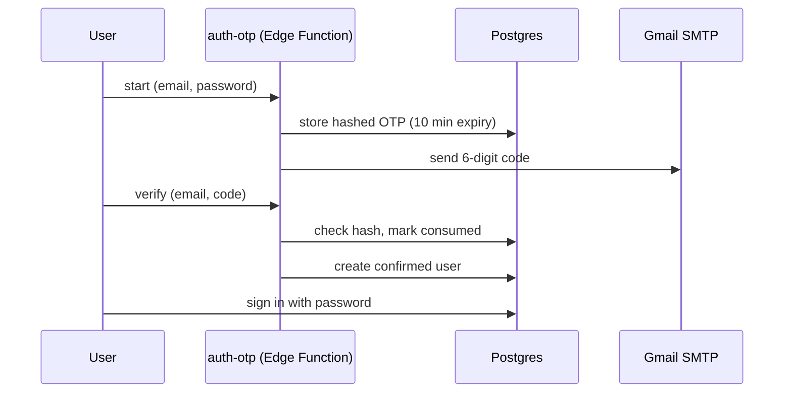

<div align="center">

# Security Consultancy Platform

**A production-style website and admin platform for a cybersecurity consultancy.**
Audit services, tools, research publishing, booking flow, OTP authentication and a role-based admin panel, on TanStack Start and Supabase.

[**Live demo**](https://viroxen.mespark.in) · [Getting started](#getting-started) · [Deploy](#deploy-on-vercel) · [Troubleshooting](#troubleshooting) · [Contact](#contact)


</div>

---

## Overview

This project is a marketing site plus a small self-service platform for a security consultancy. Public content (audit plans, add-ons, tools, products, research posts, audited clients) lives in Postgres and is managed from an authenticated admin panel, so content changes need no redeploy.

Use it as a starter for your own consultancy, agency or security-product site. See [Customizing and branding](#customizing-and-branding).

**Live demo:** https://viroxen.mespark.in

## Highlights

- **Role-based access.** Roles: `admin`, `staff_lead`, `staff`, `user`. Enforced in the database with Row Level Security and a `has_role()` security-definer function.
- **Admin panel** with CRUD for audit plans, add-ons, tools, products, research posts and audited clients (with logo upload).
- **Research publishing** with a status workflow (draft, pending review, published, rejected) and private PDF attachments served through signed URLs.
- **Custom OTP authentication.** Email OTP signup, OTP password reset and a sign-in guard that locks an account after 5 failed attempts in 15 minutes. Implemented as Supabase Edge Functions that send mail over Gmail SMTP.
- **Booking and contact flows** with email notification to your team and an automatic confirmation to the sender.
- **Staff area** with tasks and in-app notifications.
- **Server functions** (`createServerFn`) for privileged operations, so the service role key never reaches the browser.
- **Polished UI.** Tailwind v4, shadcn/ui, Framer Motion transitions, a Three.js hero, dark-first design tokens.
- **Legal pages** (privacy, terms, cookies) and a cookie banner.

## Architecture



### Signup flow



## Tech stack

| Layer | Technology |
|---|---|
| Framework | React 19, TanStack Start, TanStack Router, TanStack Query |
| Language | TypeScript |
| Styling | Tailwind CSS v4, shadcn/ui (Radix) |
| Animation | Framer Motion, Three.js via `@react-three/fiber` |
| Backend | Supabase: Postgres, Auth, Storage, Edge Functions (Deno) |
| Server runtime | Nitro |
| Tooling | Vite, ESLint, Prettier, Bun |

## Project structure

```
src/
├── routes/                    # File-based routes (TanStack Router)
│   ├── index.tsx, services.tsx, products.tsx, methodology.tsx
│   ├── research.index.tsx, research.$slug.tsx
│   ├── about.tsx, faq.tsx, contact.tsx, book.tsx
│   ├── privacy.tsx, terms.tsx, cookies.tsx
│   ├── auth.tsx, auth.reset-password.tsx
│   └── _authenticated/        # Protected: admin, dashboard, staff
├── lib/
│   ├── admin.functions.ts     # Server functions for admin CRUD (auth + role checked)
│   ├── queries.ts             # Public read-only queries
│   └── site-data.ts           # Site constants and fallback content
├── integrations/supabase/     # Supabase clients, auth middleware, generated types
└── components/                # site/, motion/, ui/ (shadcn)

supabase/
├── setup.sql                  # Full schema for a fresh project (run this)
├── migrations/                # Historical schema snapshots (reference only)
├── seed_and_fix_admins.sql    # Sample content and admin seeding
├── config.toml
└── functions/                 # auth-otp, auth-reset-otp, auth-reset-request,
                               # auth-signin-guard, notify-submission
```

## Getting started

### 1. Prerequisites

- Node.js 20.19+ (or 22+) and [Bun](https://bun.sh) (recommended, matches `bun.lock`)
- A [Supabase](https://supabase.com) project
- A Gmail account with an [App Password](https://myaccount.google.com/apppasswords) (for OTP and notification emails)

### 2. Install

```bash
git clone https://github.com/mespark/viroxen.git
cd viroxen
bun install
```

With npm: `npm install --legacy-peer-deps`. The lockfile is for Bun, so npm may resolve newer versions than the ones tested.

### 3. Environment variables

```bash
cp .env.example .env
```

| Variable | Used by | Notes |
|---|---|---|
| `SUPABASE_URL` | server | Project URL |
| `SUPABASE_PUBLISHABLE_KEY` | server | Publishable (anon) key |
| `SUPABASE_SERVICE_ROLE_KEY` | server only | Secret key. Never commit or expose it |
| `VITE_SUPABASE_URL` | browser | Same project URL |
| `VITE_SUPABASE_PUBLISHABLE_KEY` | browser | Publishable (anon) key |
| `VITE_SUPABASE_PROJECT_ID` | browser | Project ref (the part before `.supabase.co`) |
| `SITE_URL` | server | Public site URL, used for staff invite links |

### 4. Database

In the Supabase SQL Editor, on an **empty** project:

1. Open `supabase/setup.sql`, replace `admin@example.com` with your admin email, then run it.
2. Open `supabase/seed_and_fix_admins.sql`, replace the admin emails with your own, then run it to load sample plans, tools and research posts.
3. Create two Storage buckets: `research-pdfs` (**private**) and `client-logos` (**public**).

> `supabase/migrations/` contains several full-schema snapshots produced while the backend moved between projects. They are kept for history and are **not** meant to be applied one after another. Use `setup.sql` instead.

### 5. Edge Functions and secrets

Set these secrets (Dashboard: Edge Functions, Secrets):

| Secret | Purpose |
|---|---|
| `GMAIL_ADDRESS` | Sender account |
| `GMAIL_APP_PASSWORD` | Gmail app password (not your normal password) |
| `NOTIFY_TO` | Where contact and booking notifications are sent |

Deploy the five functions with the Supabase CLI:

```bash
npx supabase login
npx supabase functions deploy auth-otp auth-reset-otp auth-reset-request auth-signin-guard notify-submission \
  --project-ref <your-project-ref> --no-verify-jwt
```

The functions are called before a user has a session, so JWT verification must stay **off** (`supabase/config.toml` sets this too). Function names must match exactly, the app calls them by name.

### 6. Auth URLs

Dashboard: Authentication, URL Configuration:

- Site URL: your public URL
- Redirect URLs: `https://your-domain/**`

### 7. Run

```bash
bun run dev        # development server
bun run build      # production build
bun run preview    # preview the build
bun run lint       # ESLint
bun run format     # Prettier
```

Sign up with the admin email you put in `setup.sql` to get access to the admin panel.

## Deploy on Vercel

1. Import the repository at [vercel.com/new](https://vercel.com/new). TanStack Start is detected automatically.
2. Add the environment variables from the table above.
   - Variables starting with `VITE_` are embedded in the browser bundle, so Vercel does not allow them to be marked Sensitive. Use only the URL, publishable key and project ID there.
   - Mark `SUPABASE_SERVICE_ROLE_KEY` as **Sensitive**.
3. Deploy. After changing any `VITE_` variable, **redeploy without build cache**, because those values are baked in at build time.

## Troubleshooting

| Symptom | Cause and fix |
|---|---|
| `ERR_NAME_NOT_RESOLVED` on `*.supabase.co` | The Supabase URL in your env vars points to a project that does not exist. Copy the Project URL from Settings, API and redeploy. |
| CORS error on `/functions/v1/...` ("does not have HTTP ok status") | The function is not deployed, or JWT verification is on. Deploy with `--no-verify-jwt`. |
| Login returns 400 on `/auth/v1/token` | Wrong credentials or the user does not exist yet. Sign up first. |
| Vercel: "public framework prefix cannot use secret" | Turn off Sensitive for `VITE_*` variables. |
| `npm install` ERESOLVE (react vs `@react-three/fiber`) | `@react-three/fiber` 9.x supports React below 19.3. Keep `react` and `react-dom` on 19.2.x, or use Bun. |
| No OTP email | Check `GMAIL_ADDRESS` and `GMAIL_APP_PASSWORD` secrets and the function logs. The account needs 2-Step Verification for app passwords. |

## Customizing and branding

The sample content, name, logo and links are placeholders. To make it yours:

- `src/lib/site-data.ts`: site name, contact email, social links, plans, tools, `SITE_URL`
- `src/components/site/Logo.tsx`: logo
- `src/components/site/Footer.tsx`: social links
- `public/sitemap.xml`, `public/robots.txt`: your domain
- `supabase/functions/notify-submission/index.ts`: notification wording
- Admin panel: plans, tools, products, research and client logos are editable at runtime

## Security notes

- RLS is enabled on the application tables. Public queries return only active or published rows, and writes require the `admin` role.
- Research PDFs are private and served through short-lived signed URLs generated on the server.
- The service role key is used only on the server and in Edge Functions. Never put it in a `VITE_` variable and never commit `.env`.
- Found a vulnerability? Please email the address below instead of opening a public issue.

## Contributing

Issues and pull requests are welcome. Please do not include real credentials, customer data or personal emails in any contribution.

## License

Released under the [MIT License](./LICENSE). The license covers the source code only.

Brand names, logos, social accounts, domains and written sample content shown in this repository or the demo are not covered by the license and are not affiliated with any company of a similar name. Replace them before using this in production.

## Contact

Questions, feedback or collaboration: **contact@mespark.in**
